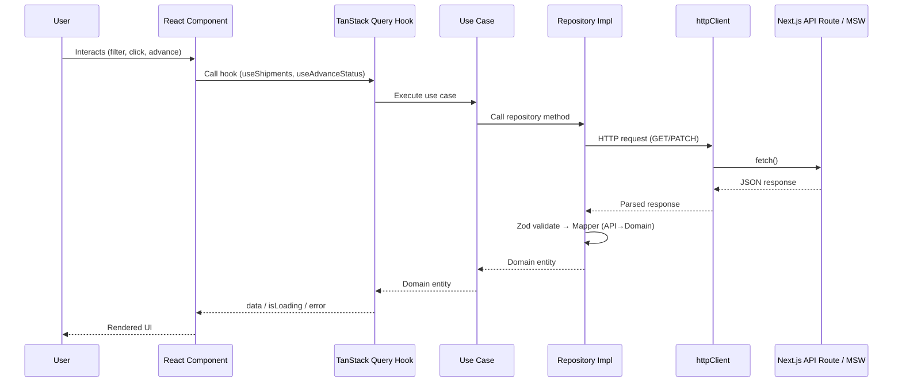

# ShipSmart — Smart Logistics Tracking Dashboard

A premium real-time logistics tracking dashboard built with **Next.js 16**, **React 19**, and **TypeScript**. ShipSmart enables operations teams to monitor, filter, and manage shipments across an entire logistics network through an immersive dark glassmorphism interface with purposeful micro-animations.

> **Live Preview:** _Not yet deployed — see [Running Locally](#running-locally) below._

---

## Table of Contents

- [Features](#features)
- [Screenshots](#screenshots)
- [Architecture Overview](#architecture-overview)
- [Data Flow](#data-flow)
- [Tech Stack](#tech-stack)
- [Prerequisites](#prerequisites)
- [Getting Started](#getting-started)
- [Available Scripts](#available-scripts)
- [Environment Variables](#environment-variables)
- [Project Structure](#project-structure)
- [Animation & Motion Design](#animation--motion-design)
- [Accessibility](#accessibility)
- [Assumptions & Design Decisions](#assumptions--design-decisions)
- [Known Limitations](#known-limitations)
- [Future Improvements](#future-improvements)
- [License](#license)

---

## Features

### Dashboard

- **Summary Stats** — animated stat cards showing Total, In Transit, Delayed, Out for Delivery, and Delivered counts with trend indicators and count-up animations.
- **Shipment Table** — sortable, responsive table displaying tracking number, customer, route, status badge, priority badge, estimated delivery, and courier.
- **Mobile Card View** — stacked card layout for viewports < 768px with all key shipment information.
- **Filter Bar** — search by keyword, filter by status/priority/destination with debounced input, and sort by estimated delivery or last updated.
- **URL-Synced Filters** — filter and sort state persists in query parameters so state is preserved on navigation and can be shared via URL.

### Shipment Detail

- **Detail Header** — tracking number, customer name, status badge, priority badge, and courier information.
- **Route Info** — origin → destination with formatted estimated delivery date.
- **Route Progress Visual** — animated horizontal node path with completed/current/upcoming states, pulsing current node, and connecting progress line.
- **Timeline** — chronological list of all shipment events with status dots, descriptions, and timestamps; staggered entrance animation.
- **Status Mutation** — advance shipment status with optimistic UI updates, success/error toasts, automatic query invalidation, and rollback on failure.
- **Confirmation Dialog** — focus-trapped modal for confirming status transitions with keyboard (Escape) close and portal rendering.

### UI & Polish

- **Dark Glassmorphism Theme** — deep midnight indigo background (`#080b20`) with radial purple/blue glow spots, frosted glass cards with `backdrop-blur`, and semi-transparent borders.
- **Custom Target Cursor** — animated crosshair cursor that locks onto interactive elements, spins when free-roaming, and morphs to a white lock-on state on hover.
- **Decrypted Text Effect** — matrix-style character scramble animation on the dashboard title.
- **Toast Notifications** — portal-based, auto-dismiss notifications for mutation success/failure with action buttons.
- **Responsive Design** — four breakpoints (mobile < 640px, tablet 640–1024px, desktop 1024–1440px, wide > 1440px).
- **Skip-to-Content Link** — keyboard-accessible skip link for screen reader users.

---

## Screenshots

> Run `pnpm dev` and open `http://localhost:3000` to see the full UI in action.

---

## Architecture Overview

ShipSmart follows a **feature-sliced Clean Architecture** pattern within the Next.js App Router. Each feature is self-contained with clearly separated layers:

```
┌─────────────────────────────────────────────────────────┐
│                    Presentation Layer                    │
│  (React components, hooks, pages — app/ + presentation/)│
├─────────────────────────────────────────────────────────┤
│                    Application Layer                     │
│         (Use cases — orchestrate domain logic)           │
├─────────────────────────────────────────────────────────┤
│                      Domain Layer                        │
│  (Entities, value objects, repository contracts, errors) │
├─────────────────────────────────────────────────────────┤
│                  Infrastructure Layer                    │
│ (API schemas, mappers, HTTP client, repo implementations)│
└─────────────────────────────────────────────────────────┘
```

### Layer Responsibilities

| Layer              | Responsibility                                                                                                  | Dependencies              |
| ------------------ | --------------------------------------------------------------------------------------------------------------- | ------------------------- |
| **Domain**         | Pure business logic — `Shipment` entity with behavior methods (`canAdvance`, `isDelayed`, `advanceStatus`), status transition rules, branded `TrackingNumber` type, custom error classes. | None (zero imports)       |
| **Application**    | Use-case orchestration — `getShipments`, `getShipment`, `advanceShipmentStatus`, `filterShipments`. Calls domain via repository contracts.                                               | Domain                    |
| **Infrastructure** | External concerns — Zod schemas for API validation, mapper functions (API → Domain), `httpClient` wrapper, repository implementations that fulfill domain contracts.                       | Domain, external packages |
| **Presentation**   | UI — React components, TanStack Query hooks (data fetching + caching), URL filter sync, Framer Motion animations.                                                                         | All layers                |

### Key Design Principles

- **Dependency inversion** — Domain defines repository _interfaces_; Infrastructure provides _implementations_. The domain layer has zero knowledge of HTTP, React, or any framework.
- **Immutable entities** — All domain entities are created via factory functions and frozen with `Object.freeze()`.
- **Typed error boundaries** — Custom error classes (`ShipmentNotFoundError`, `InvalidTransitionError`, `NetworkError`) enable precise error handling in the UI.
- **Single source of truth for status** — `ShipmentStatus` type and `VALID_TRANSITIONS` map are defined once in the domain layer; constants in `/constants` provide display labels.

---

## Data Flow



### Mutation Flow (Optimistic Updates)

1. User clicks "Advance Status" → mutation hook fires.
2. `onMutate`: query cache is updated **immediately** with the new status (optimistic).
3. HTTP PATCH request is sent to the API.
4. `onSuccess`: related queries are invalidated; success toast is shown.
5. `onError`: optimistic update is **rolled back** to the previous state; error toast with retry option.

---

## Tech Stack

| Category         | Technology                                          | Version |
| ---------------- | --------------------------------------------------- | ------- |
| Framework        | [Next.js](https://nextjs.org) (App Router)          | 16.2    |
| Language         | [TypeScript](https://www.typescriptlang.org) (strict mode) | 5.9     |
| UI Library       | [React](https://react.dev)                          | 19.2    |
| Styling          | [Tailwind CSS](https://tailwindcss.com) v4          | 4.3     |
| CSS Utility      | [tailwind-merge](https://github.com/dcastil/tailwind-merge) | 3.6     |
| Data Fetching    | [TanStack React Query](https://tanstack.com/query)  | 5.66    |
| Animation        | [Framer Motion](https://motion.dev)                 | 12.42   |
| Animation (adv.) | [GSAP](https://gsap.com)                            | 3.15    |
| WebGL            | [OGL](https://github.com/oframe/ogl)                | 1.0     |
| Schema Validation| [Zod](https://zod.dev)                              | 3.24    |
| Forms            | [React Hook Form](https://react-hook-form.com) + [@hookform/resolvers](https://github.com/react-hook-form/resolvers) | 7.54 |
| Dates            | [date-fns](https://date-fns.org)                    | 4.4     |
| Testing          | [Jest](https://jestjs.io) + [React Testing Library](https://testing-library.com/react) | 29.7 / 16.2 |
| API Mocking      | [MSW](https://mswjs.io) (Mock Service Worker)       | 2.7     |
| Linting          | [ESLint](https://eslint.org) (flat config) + [eslint-config-next](https://nextjs.org/docs/app/api-reference/config/eslint) | 9.39 |
| Formatting       | [Prettier](https://prettier.io) + [prettier-plugin-tailwindcss](https://github.com/tailwindlabs/prettier-plugin-tailwindcss) | 3.9 |
| Package Manager  | [pnpm](https://pnpm.io)                             | latest  |
| React Compiler   | [babel-plugin-react-compiler](https://react.dev/learn/react-compiler) | 1.0     |

---

## Prerequisites

- **Node.js** ≥ 18.17 (LTS recommended)
- **pnpm** ≥ 8 — install via `npm install -g pnpm` or `corepack enable`

---

## Getting Started

```bash
# 1. Clone the repository
git clone https://github.com/<your-org>/shipsmart.git
cd shipsmart

# 2. Install dependencies
pnpm install

# 3. Copy the environment file
cp .env.example .env.local
# Edit .env.local with your API base URL (or leave the default for MSW mock mode)

# 4. Start the development server
pnpm dev
```

Open [http://localhost:3000](http://localhost:3000) in your browser. The app redirects to `/shipments` — the main dashboard.

---

## Available Scripts

| Command              | Description                                       |
| -------------------- | ------------------------------------------------- |
| `pnpm dev`           | Start Next.js development server with hot reload  |
| `pnpm build`         | Create optimized production build                 |
| `pnpm start`         | Serve production build locally                    |
| `pnpm lint`          | Run ESLint across the project                     |
| `pnpm test`          | Run Jest test suite                               |
| `pnpm test:watch`    | Run tests in watch mode                           |
| `pnpm format`        | Check code formatting with Prettier               |
| `pnpm format:write`  | Auto-fix formatting issues                        |

---

## Environment Variables

| Variable                    | Required | Description                              | Default                        |
| --------------------------- | -------- | ---------------------------------------- | ------------------------------ |
| `NEXT_PUBLIC_API_BASE_URL`  | Yes      | Base URL for the shipment tracking API   | `https://api.example.com/api`  |

> **Note:** During development, Next.js API routes (`/api/shipments/*`) serve as a mock API backed by MSW handlers with in-memory data — no external API is required.

---

## Project Structure

```
shipsmart/
├── public/                          # Static assets (logo, SVGs)
├── src/
│   ├── app/                         # Next.js App Router
│   │   ├── api/shipments/           # API route handlers (mock backend)
│   │   ├── shipments/               # Dashboard page + layout
│   │   │   ├── [trackingNumber]/    # Dynamic detail route
│   │   │   │   ├── page.tsx         # Detail page entry
│   │   │   │   ├── ShipmentDetailContent.tsx
│   │   │   │   ├── layout.tsx       # Detail layout with animation
│   │   │   │   ├── loading.tsx      # Skeleton loading state
│   │   │   │   └── error.tsx        # Error boundary
│   │   │   ├── page.tsx             # Dashboard page entry
│   │   │   ├── ShipmentsContent.tsx  # Dashboard client component
│   │   │   ├── layout.tsx           # Shipments layout
│   │   │   ├── loading.tsx          # Dashboard skeleton
│   │   │   └── error.tsx            # Dashboard error boundary
│   │   ├── layout.tsx               # Root layout (providers, cursor, fonts)
│   │   ├── page.tsx                 # Root redirect → /shipments
│   │   └── globals.css              # Design tokens, base styles, utilities
│   │
│   ├── components/                  # Shared, reusable components
│   │   ├── ui/                      # Primitives (Button, Input, Table, Badge, etc.)
│   │   ├── layout/                  # PageHeader, Container
│   │   └── feedback/                # Toast, ConfirmationDialog
│   │
│   ├── features/
│   │   └── shipment-tracking/       # Feature module (Clean Architecture)
│   │       ├── domain/              # Business logic (zero framework deps)
│   │       │   ├── entities/        # Shipment, TimelineEvent, Courier
│   │       │   ├── value-objects/   # TrackingNumber, StatusTransition
│   │       │   ├── repositories/    # Repository interfaces (contracts)
│   │       │   └── errors/          # Domain-specific error classes
│   │       ├── application/         # Use cases
│   │       │   └── use-cases/       # getShipments, advanceStatus, filter, etc.
│   │       ├── infrastructure/      # External integrations
│   │       │   ├── api/             # Endpoints, Zod schemas, mappers, query keys
│   │       │   └── repositories/    # Repository implementations
│   │       └── presentation/        # UI layer
│   │           ├── components/      # Feature-specific components
│   │           ├── hooks/           # TanStack Query hooks, filter hooks
│   │           ├── schemas/         # Form validation schemas
│   │           └── utils/           # Presentation utilities
│   │
│   ├── constants/                   # Status enums, labels, priority definitions
│   ├── hooks/                       # Global hooks (useAnimation, useMediaQuery)
│   ├── interfaces/                  # Shared TypeScript interfaces
│   ├── lib/                         # Core utilities
│   │   ├── api/                     # HTTP client (fetch wrapper with timeout)
│   │   ├── query/                   # QueryClient configuration
│   │   └── utils/                   # Date utilities
│   ├── mocks/                       # MSW handlers + server setup
│   ├── providers/                   # QueryProvider (TanStack)
│   ├── styles/                      # Additional style modules
│   └── types/                       # Global type definitions (domain.ts, api.ts)
│
├── .env.example                     # Environment variable template
├── .prettierrc                      # Prettier configuration
├── eslint.config.mjs                # ESLint flat config
├── jest.config.js                   # Jest configuration
├── next.config.ts                   # Next.js configuration (React Compiler enabled)
├── tsconfig.json                    # TypeScript strict config with path aliases
└── DEVELOPMENT_STAGES.md            # Granular 155-stage development plan
```

---

## Animation & Motion Design

ShipSmart uses **three animation libraries** — each chosen for a specific purpose:

| Library         | Use Case                                                                                                                    |
| --------------- | --------------------------------------------------------------------------------------------------------------------------- |
| **Framer Motion** | Layout and page transitions, stat card entrances, timeline stagger, status badge scale on mutation, route progress nodes. |
| **GSAP**          | TargetCursor crosshair — smooth DOM positioning and SVG rotation require GSAP's timeline precision and RAF-based rendering. |
| **CSS Keyframes** | Skeleton shimmer (`@keyframes skeleton-loading`), scrollbar styling, pulse on current progress node.                       |

### Animation Inventory

| Animation                        | Trigger                      | Purpose                                 |
| -------------------------------- | ---------------------------- | --------------------------------------- |
| Stat card count-up               | Mount                        | Draw attention to key metrics           |
| Stat card fade + slide           | Mount (staggered)            | Progressive reveal                      |
| Timeline event stagger           | Mount (per-event delay)      | Visual hierarchy for chronological data |
| Route progress node pulse        | Current node active           | Communicate current shipment stage      |
| Status badge scale               | Mutation success              | Confirm status change feedback          |
| Page transition (layout)         | Route change                 | Smooth navigation continuity            |
| Target cursor lock/unlock        | Mouse hover on interactive   | Gamified engagement cursor              |
| Decrypted text scramble          | Dashboard title mount        | Premium "hacker" aesthetic              |
| Toast slide-in/out               | Mutation result               | Non-blocking notifications              |
| Skeleton shimmer                 | Loading states                | Perceived performance while loading     |

### Reduced Motion

All non-essential animations are disabled when the user has `prefers-reduced-motion: reduce` enabled:

```css
@media (prefers-reduced-motion: reduce) {
  *, *::before, *::after {
    animation-duration: 0.01ms !important;
    animation-iteration-count: 1 !important;
    transition-duration: 0.01ms !important;
    scroll-behavior: auto !important;
  }
}
```

Additionally, Framer Motion animations check for reduced motion via a `useAnimation` hook that returns `false` for `initial`/`animate` when the preference is active.

---

## Accessibility

| Feature                          | Implementation                                                       |
| -------------------------------- | -------------------------------------------------------------------- |
| Skip-to-content link            | Hidden link at top of page, visible on keyboard focus                |
| Focus styles                    | 2px blue outline with 2px offset on all interactive elements         |
| Semantic HTML                   | `<main>`, `<nav>`, `<h1>`–`<h3>` hierarchy, `<table>` with `<thead>` |
| ARIA labels                     | Icon-only buttons, status badges, sort controls                     |
| Status not color-alone          | Every status badge includes a dot indicator + text label             |
| Touch targets                   | Minimum 44×44px on coarse pointer devices                           |
| High contrast support           | `@media (prefers-contrast: high)` overrides for badge backgrounds   |
| Keyboard navigation             | Tab order, `Escape` to close dialogs, focus trap in modals          |
| Print styles                    | Hides navigation, filters, buttons for clean printouts              |
| Locale-aware dates              | `date-fns` formatting respects user locale                          |

---

## Assumptions & Design Decisions

1. **Mock API in development** — The app ships with a full in-memory mock backend (MSW + Next.js API routes) containing ~12 sample shipments. No external API or database is required to run the project. In production, swap `NEXT_PUBLIC_API_BASE_URL` to point to a real API.

2. **Client-side filtering** — All shipments are fetched once and filtered/sorted on the client. This is sufficient for the expected data volume (hundreds of shipments). For thousands+, server-side pagination would be introduced.

3. **Optimistic updates** — Status mutations update the UI cache immediately before the API confirms, then roll back on failure. This provides the snappiest UX but assumes most mutations succeed.

4. **Branded types over runtime validation** — `TrackingNumber` is a branded `string` type (`string & { __brand: 'TrackingNumber' }`). It provides compile-time safety without runtime overhead; upstream validation is assumed.

5. **Single-feature module** — The app has one feature (`shipment-tracking`). The Clean Architecture layers are deliberately granular to demonstrate the pattern's scalability — in a real-world app, additional features (fleet management, analytics, user settings) would follow the same structure.

6. **Dark theme only** — The glassmorphism design is built for dark mode exclusively. There is no light mode toggle. The design system's CSS custom properties (`--bg-base`, `--glass-bg`, etc.) could be extended with a light theme in future.

7. **pnpm only** — The project uses pnpm workspaces and an exact lockfile. While `npm` or `yarn` may work, they are not tested.

8. **React Compiler** — `next.config.ts` enables the experimental React Compiler (`reactCompiler: true`). This auto-memoizes components and hooks, reducing the need for manual `useMemo`/`useCallback`.

---

## Known Limitations

| Area                  | Limitation                                                                                            |
| --------------------- | ----------------------------------------------------------------------------------------------------- |
| **Pagination**        | Not implemented — all shipments are loaded at once. Would need server-side pagination for large datasets. |
| **Authentication**    | No auth layer — the dashboard is open access. Would need JWT/session-based auth for production.       |
| **Real-time updates** | No WebSocket or SSE integration — data refreshes only on user action or window refocus (if enabled). |
| **Offline support**   | No service worker or offline cache — the app requires an active network connection.                  |
| **Internationalization** | English only — no i18n framework is integrated. Dates do use locale-aware formatting.             |
| **E2E tests**         | No Playwright/Cypress integration — only unit and integration tests via Jest + RTL.                  |
| **Database**          | In-memory mock data resets on each server restart. No persistent storage layer.                       |

---

## Future Improvements

- [ ] **Server-side pagination** with cursor-based API and infinite scroll
- [ ] **WebSocket integration** for live shipment status pushes
- [ ] **Authentication** with role-based access (admin, dispatcher, viewer)
- [ ] **Light/dark theme toggle** with system preference detection
- [ ] **Playwright E2E tests** for critical user flows
- [ ] **PWA support** with service worker for offline access
- [ ] **Map visualization** showing shipment routes on an interactive map
- [ ] **Analytics dashboard** with delivery time trends and courier performance
- [ ] **Notification system** with email/SMS alerts for status changes
- [ ] **Multi-language support** with `next-intl` or similar i18n framework
- [ ] **Deploy** to Vercel/Netlify with CI/CD pipeline

---

## License

This project is private and not currently licensed for public distribution.
